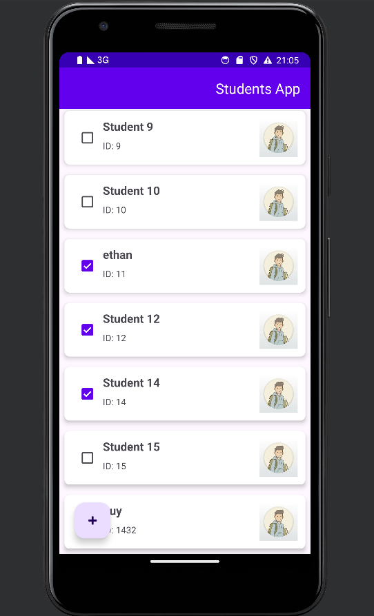
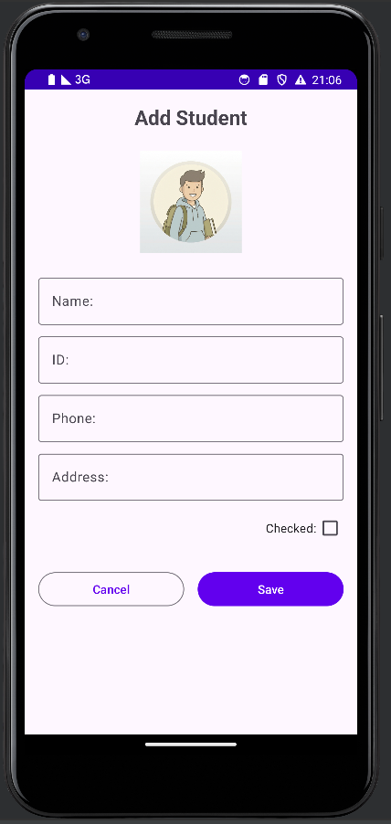

# Students App - Assignment 2

A simple Android application for managing student records, built with **Kotlin** and **MVVM Architecture**.

## 📱 Features

-   **Student List**: View a complete list of students with their name, ID, and check status.
-   **Add Student**: Add new student records with ease.
-   **Student Details**: Detailed view of student information including phone and address.
-   **Edit/Delete**: Full management capabilities—update any field or remove records.
-   **Interactive Checkbox**: Quickly toggle the check status of students directly from the list.

## 🏗️ Architecture

The app is built following standard Android development best practices:
-   **MVVM**: Separation of concerns between UI, Business Logic, and Data.
-   **ViewBinding**: Safe and efficient access to view components.
-   **Singleton Repository**: Centralized in-memory data management.
-   **RecyclerView**: Optimized list rendering for performance.

## 🛠️ Configuration

The project is pre-configured to be compatible with:
-   **Android Studio**: Hedgehog or newer.
-   **AGP Version**: 8.1.0 (optimized for wide compatibility).
-   **Gradle Version**: 8.0.1.
-   **AndroidX**: Fully enabled.

## 🚀 Getting Started

1.  Clone/Open the project in **Android Studio**.
2.  **Sync** Gradle files to download dependencies.
3.  **Run** the app on an emulator or physical device (Min SDK: 24).

---
*Created for the Mobile Course - Assignment 2*